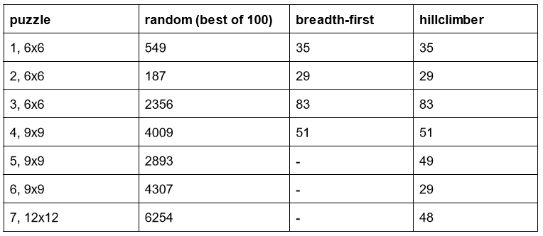

# 60 Minute Dash
 
## Rush hour
Rush hour is a board game in which the goal is to move the red car towards the right side of the board. A car can only move forwards and backwards in the direction it is facing. A car cannot move through tiles on which another car is situated.

There are a total of seven different boards with increasing difficulty:
* Boards 1, 2 and 3 are 6x6 boards.
* Boards 4, 5 and 6 are 9x9 boards.
* Board 7 is a 12x12 board.

Board 1 for example looks like this:

For a visual representation of every board, check out the images in the doc folder.

## Getting started
### Requirements
All of  the code in this repository was written with Python 3.8.10. All the required packages to run this code can be installed with the following command:
> pip3 install -r requirements.txt
 
### Usage
The program can be run by running main.py and makes use of multiple command line arguments:
* -h; show usage of command line 
* -b; specify the board filename and the dimension of the board. For example: 
> -b Rushhour6x6_1.csv 6

* -a; specify the algorithm of choice (random, breadth-first or hillclimber)
* -o; specify the output filename, if not specified no output will be generated
* -t; time the algorithm 
* -v; visualize the newly generated solution using pygame, must be used in combination with -o
* -s; show a already generated solution, requires a solution file to be specified, if run with inititalstate.csv, it will show the initial board

### Examples
To generate an optimal solution for puzzle 1 with the breadth first algorithm, which is visualized in pygame and timed, the following line can be run.
> python3 main.py -b Rushhour6x6_1.csv 6 -a breadth-first -t -o output_puzzle_1 -v

To show the initial state of puzzle 7 run:
> python3 main.py -b Rushhour12x12_7 12 -s initialstate.csv

Or to use an existing solution file:
> python3 main.py -b Rushhour12x12_7 12 -s {example_solution_file.csv}

## Algorithms
There are three algorithms available that can be used to solve a rush hour game. They can be run by typing their name after a “-a”.
Available algorithms are:
* hillclimber, uses a solution from random and finds the local minimum amount of steps to complete this board. Does this 100 times and returns the best result.
* random, solves a board with random steps 10 times and returns the best solution
* breadth-first, solves a board with minimal steps but does not work on puzzles 5, 6 and 7

## Experiment
### Breadth-first
After having tried different values for the score threshold that is used to prune the boards, it appears that 2 is the optimal value. Using a larger or a lower value resulted in worse solutions. A bigger value resulted in the same number of steps, but it took more time. A lower value resulted in a worse solution or no solution at all.
### Hillclimber
We have run the hillclimber algorithm 1000 times on all seven boards. This resulted in the following solutions with minimal moves:

This experiment showed that hillclimber is able to produce solutions with a low amount of moves. After 1000 tries on each puzzle, we are quite confident that our solutions for boards 5, 6 and 7 are either the best or close to the best solution. Because we have used breadth-first on the first four boards, we are almost certain that our solutions for these boards are optimal.

## Structure
The following list shows the structure of this repository:
* /code: Contains all the code for this project
    - /code/algorithms: Contains files with a class for each algorithm
    - /code/classes: Contains the files with the board and car class
    - /code/visualisation: Contains classes and functions used for visualization purposes
* /data: Contains the scoreboards and outputted solutions
    - /data/best_solution: Contains the best found solution for each game board
    - /data/gameboards: Contains the files for the game boards that can be run
    - /data/output: All the outputted solutions will be stored here 

## Authors
* Lars Disberg
* Steven Nederend
* Noud Hover
